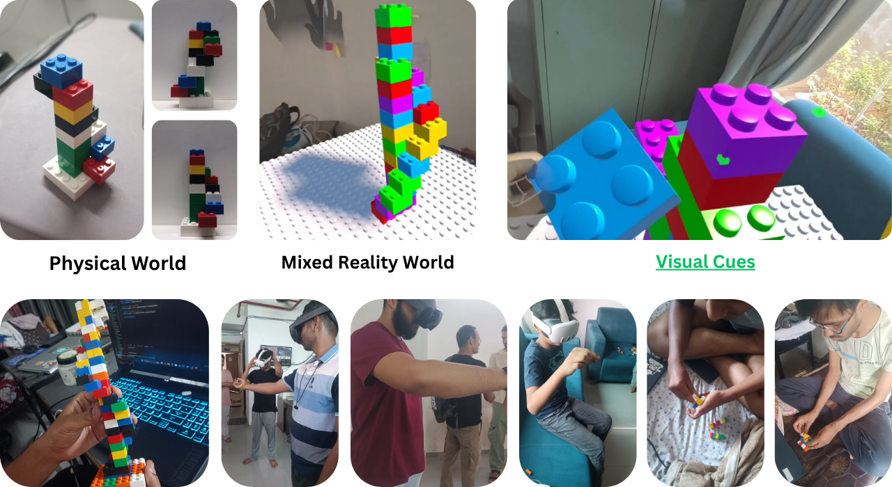

# LEGO Cognitive Studies

This repository contains the Unity project and supporting materials for the accepted research paper **"Mixed Reality LEGO vs. Physical LEGO: Cognitive, Emotional, and Motor Advantages"**. The project demonstrates experimental scenes and assets used in our cognitive, emotional, and motor assessment comparing mixed-reality LEGO interactions with physical LEGO.

## Snapshot



> Accepted paper (PDF): **B065_Mixed Reality LEGO vs. Physical LEGO Cognitive, Emotional, and Motor Advantages.pdf**

PDF location (local, not checked into Git for size):

```plaintext
C:\Users\amonk\Music\B065_Mixed Reality LEGO vs. Physical LEGO Cognitive, Emotional, and Motor Advantages.pdf
```

## Unity project

- **Unity Editor version**: 2023.1.2f1 (from `ProjectSettings/ProjectVersion.txt`: `m_EditorVersion: 6000.1.2f1`)
- Open the project using Unity Hub and select the above Editor version. If you don't have that exact version, Unity will usually offer to upgrade; prefer using the recorded version for exact compatibility.

**Project folders of interest:**

- `Assets/` — All game assets, scenes, textures, prefabs and scripts.
- `Packages/` — Manifest listing packages used by the project.
- `ProjectSettings/` — Project-level configuration (includes `ProjectVersion.txt`).


## Snap prediction algorithm

This project uses a simple, robust snap prediction algorithm for snap-interactors (e.g., virtual LEGO studs/holes). The approach evaluates a 2x2 grid of candidate snap blocks around the collision/vicinity area and picks the snap point closest to the held/interactable block's current location, subject to availability.

High-level behavior:

- Build a 2x2 candidate block set around the collision/vicinity area of the snap interactor.
- For each candidate block, enumerate its available snap points (unoccupied connection points).
- Compute the world-space distance from the held/interactable block's reference point (for example the block's grab transform or center) to each candidate snap point.
- Choose the nearest available snap point. If none are available in the 2x2 area, optionally expand the search or fall back to the interactor's default snap.

Pseudocode (conceptual):

```pseudo
function predictSnapPoint(heldBlockRef, snapInteractor, searchRadius = small):
    // 1. determine vicinity center from collision or snapInteractor position
    center = snapInteractor.collisionCenter or snapInteractor.position

    // 2. build 2x2 grid anchored around center (this depends on your grid/orientation)
    candidates = build2x2Grid(center, cellSize = snapInteractor.gridUnit)

    best = None
    bestDist = +Infinity

    for each blockLoc in candidates:
        snapPoints = getAvailableSnapPoints(blockLoc)
        for each point in snapPoints:
            d = distance(point.worldPosition, heldBlockRef.worldPosition)
            if d < bestDist:
                bestDist = d
                best = (blockLoc, point)

    if best != None:
        return best.point
    else:
        // fallback policy
        return snapInteractor.defaultSnapPoint

```

Edge cases and notes:

- Orientation: If blocks can rotate, compute the distance from a consistent reference point (grab transform) and, if desired, include an orientation penalty term when comparing candidate snap points.
- Availability: "Available" snap points must be checked atomically — concurrent snaps should lock or reserve points during the short prediction -> snap commit window.
- Expandable search: If the 2x2 region has no available points, gradually expand to 3x3 or search nearest neighbors until a limit.
- Performance: Limit checks to nearby blocks (spatial hashing, physics queries, or layer-filtered overlap tests) to keep prediction fast.
- Robustness: Add a small hysteresis or threshold so tiny hand jitter doesn't flip snap targets repeatedly.

Unity implementation tips:

- Use overlap box/sphere queries (Physics.OverlapBox or OverlapSphere) with a layer mask to find nearby snap interactors quickly.
- Maintain a pool of snap points with a boolean `isOccupied` flag and a short reservation TTL to avoid race conditions when multiple hands/controllers attempt snapping.
- Use local grid coordinates (integers) to compute the 2x2 neighbor set deterministically if your LEGO grid is aligned to world axes.
- For visual debugging, draw gizmos for candidate points and the chosen prediction (Gizmos.DrawSphere / Handles.Label in editor).

If you'd like, I can convert this pseudocode into C# Unity code (including reservation/lock behavior, orientation penalty, and a small unit test) and add it to `Assets/Scripts/`.

## How to view the research materials

1. Copy the accepted paper PDF into the repository root (optional) or leave it at your local path. If you want it inside the repo, copy it to `docs/` or `Research/` and commit.
2. To view the research snapshot image in this README, ensure `Research.png` is at the repository root next to this `README.md`. Current path used for the image in this README is relative: `Research.png`.

If you prefer to keep images in a folder, update the image link accordingly, for example `docs/Research.png`.

## Notes for reproducibility

- Record your Unity Editor version before opening (`ProjectSettings/ProjectVersion.txt` contains `m_EditorVersion: 6000.1.2f1`, which maps to Unity 2023.1.2f1).
- Commit the research PDF only if your institution and publisher allow repository hosting of the accepted manuscript. If not, include a citation and a DOI or link instead.

## Citation

Please use the following citation for the accepted manuscript when referencing this project and repository in publications or presentations:

"Mixed Reality LEGO vs. Physical LEGO: Cognitive, Emotional, and Motor Advantages" — accepted manuscript (PDF on local machine).

If you want, paste the formal citation (authors, venue, year) here and I will add a formatted BibTeX entry.

## Repository structure (high level)

- `Assets/` — Unity assets (models, materials, prefabs, scenes)
- `Packages/` — Unity packages manifest
- `ProjectSettings/` — Unity project settings
- `README.md` — This file
- `LICENSE` — Project license

## Next steps you might want

1. Move the accepted PDF into `docs/` and add a small README in `docs/` with a short abstract.
2. Add a `LICENSE` note for the paper (if allowed) and a `CITATION.cff`/`CITATION.md` with BibTeX.
3. Add a short video or GIF of the mixed-reality interactions to `docs/media/` for quick demos.

## Contact

If you'd like edits to the README (more formality, a BibTeX entry, or different image placement), tell me what to include and I'll update it.

---

Generated/updated on: 2025-10-18

## External links & press

- [LinkedIn post announcing the publication](https://www.linkedin.com/posts/pramit-mazumdar-6b953a19_publicationalert-arvr-metaverse-ugcPost-7337905771575177216-ohc8?utm_source=share&utm_medium=member_desktop&rcm=ACoAADackOwBjDotp419TKzDYU3v7E8Jzu-MAio)
